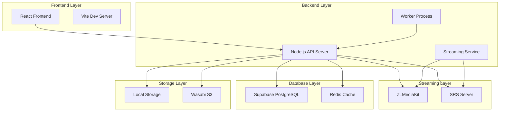
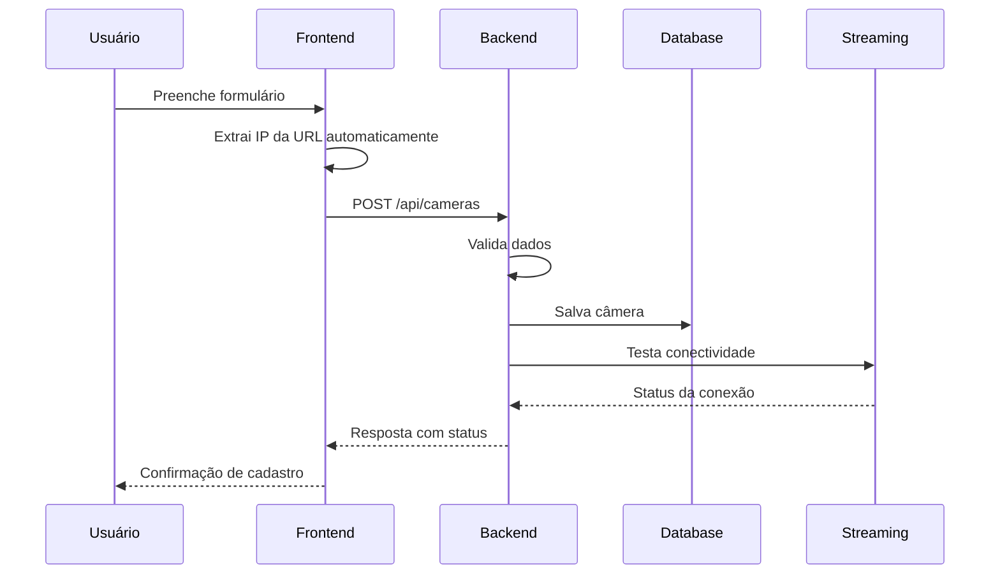
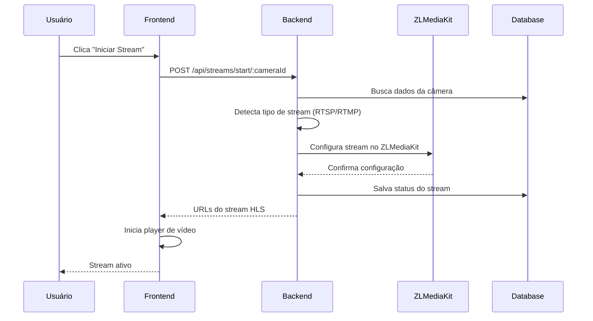
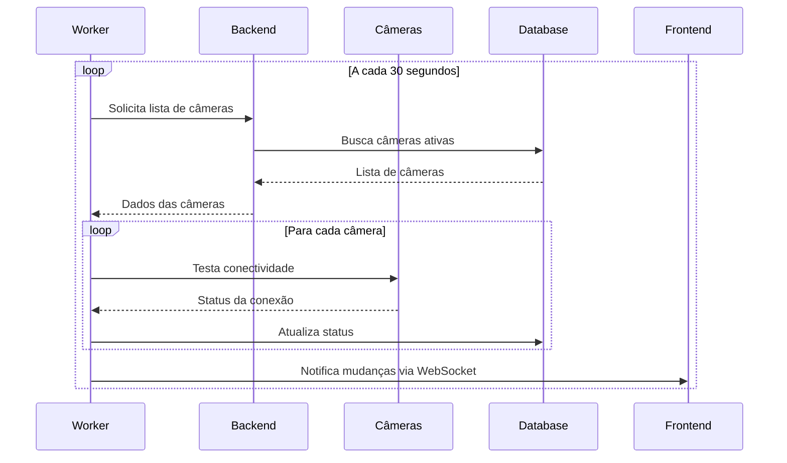
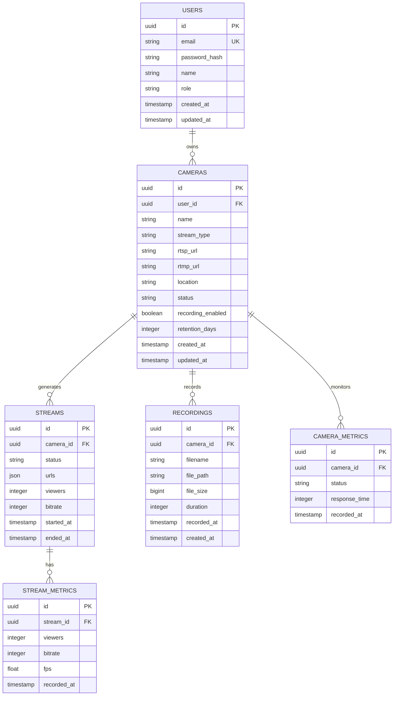

# 📹 NewCAM - Documentação Master Completa

## 🎯 Visão Geral do Projeto

**NewCAM** é um sistema completo de monitoramento e streaming de câmeras IP em tempo real, desenvolvido com tecnologias modernas para oferecer alta performance, escalabilidade e facilidade de uso.

### 🚀 Características Principais

- **Streaming em Tempo Real**: Suporte para RTSP e RTMP com baixa latência
- **Interface Moderna**: Frontend React com design responsivo e intuitivo
- **Arquitetura Escalável**: Backend Node.js com microserviços
- **Gravação Automática**: Sistema de gravação com retenção configurável
- **Monitoramento Inteligente**: Detecção automática de status das câmeras
- **Autenticação Segura**: Sistema completo de login e permissões
- **Multi-plataforma**: Suporte para Windows, Linux e macOS

---

## 🏗️ Arquitetura do Sistema

### 📊 Diagrama de Arquitetura



### 🔧 Stack Tecnológico

#### Frontend
- **React 18** - Framework principal
- **TypeScript** - Tipagem estática
- **Vite** - Build tool e dev server
- **Tailwind CSS** - Framework de estilos
- **React Router** - Roteamento
- **Axios** - Cliente HTTP
- **React Hot Toast** - Notificações
- **Lucide React** - Ícones

#### Backend
- **Node.js** - Runtime JavaScript
- **Express.js** - Framework web
- **JWT** - Autenticação
- **Multer** - Upload de arquivos
- **Winston** - Sistema de logs
- **Cors** - Cross-origin requests
- **Helmet** - Segurança HTTP

#### Streaming
- **ZLMediaKit** - Servidor de streaming principal
- **SRS** - Servidor de streaming alternativo
- **FFmpeg** - Processamento de vídeo
- **HLS** - Protocolo de streaming

#### Database & Storage
- **Supabase** - Backend-as-a-Service
- **PostgreSQL** - Banco de dados principal
- **Redis** - Cache e sessões
- **Wasabi S3** - Armazenamento em nuvem

---

## 📁 Estrutura do Projeto

```
NewCAM/
├── 📂 frontend/                 # Aplicação React
│   ├── 📂 src/
│   │   ├── 📂 components/       # Componentes reutilizáveis
│   │   ├── 📂 pages/           # Páginas da aplicação
│   │   ├── 📂 services/        # Serviços e APIs
│   │   ├── 📂 contexts/        # Contextos React
│   │   ├── 📂 hooks/           # Custom hooks
│   │   ├── 📂 types/           # Definições TypeScript
│   │   └── 📂 utils/           # Utilitários
│   └── 📄 package.json
├── 📂 backend/                  # API Node.js
│   ├── 📂 src/
│   │   ├── 📂 controllers/     # Controladores
│   │   ├── 📂 services/        # Lógica de negócio
│   │   ├── 📂 models/          # Modelos de dados
│   │   ├── 📂 routes/          # Rotas da API
│   │   ├── 📂 middleware/      # Middlewares
│   │   ├── 📂 config/          # Configurações
│   │   └── 📂 utils/           # Utilitários
│   ├── 📂 storage/             # Armazenamento local
│   ├── 📂 supabase/           # Migrações do banco
│   └── 📄 package.json
├── 📂 worker/                   # Worker process
├── 📂 docker/                   # Configurações Docker
├── 📂 docs/                     # Documentação
├── 📂 scripts/                  # Scripts utilitários
└── 📄 README.md
```

---

## 🚀 Guia de Instalação

### 📋 Pré-requisitos

- **Node.js** 18+ 
- **npm** ou **yarn**
- **Git**
- **PostgreSQL** (via Supabase)
- **Redis** (opcional)
- **FFmpeg** (para processamento de vídeo)

### 🔧 Instalação Passo a Passo

#### 1. Clone o Repositório
```bash
git clone <repository-url>
cd NewCAM
```

#### 2. Configuração do Backend
```bash
cd backend
npm install
cp .env.example .env
```

#### 3. Configuração do Frontend
```bash
cd ../frontend
npm install
```

#### 4. Configuração do Worker
```bash
cd ../worker
npm install
```

#### 5. Configuração das Variáveis de Ambiente

Edite o arquivo `.env` no backend:

```env
# Servidor
PORT=3000
NODE_ENV=development

# Supabase
SUPABASE_URL=your_supabase_url
SUPABASE_ANON_KEY=your_supabase_anon_key
SUPABASE_SERVICE_ROLE_KEY=your_service_role_key

# JWT
JWT_SECRET=your_jwt_secret

# ZLMediaKit
ZLM_SECRET=your_zlm_secret
ZLMEDIAKIT_API_URL=http://localhost:8000
ZLMEDIAKIT_RTSP_PORT=8554
ZLMEDIAKIT_RTMP_PORT=1935

# SRS
SRS_API_URL=http://localhost:1985
SRS_RTMP_PORT=1935

# Redis (opcional)
REDIS_URL=redis://localhost:6379

# Storage
WASABI_ACCESS_KEY=your_wasabi_access_key
WASABI_SECRET_KEY=your_wasabi_secret_key
WASABI_BUCKET=your_bucket_name
WASABI_REGION=us-east-1
```

#### 6. Executar Migrações do Banco
```bash
cd backend
node run_migrations.js
```

#### 7. Iniciar os Serviços

**Terminal 1 - Backend:**
```bash
cd backend
npm run dev
```

**Terminal 2 - Frontend:**
```bash
cd frontend
npm run dev
```

**Terminal 3 - Worker:**
```bash
cd worker
npm run dev
```

---

## 🔌 APIs e Endpoints

### 🔐 Autenticação

#### POST `/api/auth/login`
**Descrição:** Autenticar usuário

**Request:**
```json
{
  "email": "user@example.com",
  "password": "password123"
}
```

**Response:**
```json
{
  "success": true,
  "data": {
    "token": "jwt_token",
    "user": {
      "id": "uuid",
      "email": "user@example.com",
      "role": "admin"
    }
  }
}
```

### 📹 Câmeras

#### GET `/api/cameras`
**Descrição:** Listar todas as câmeras

**Response:**
```json
{
  "success": true,
  "data": [
    {
      "id": "uuid",
      "name": "Câmera Principal",
      "stream_type": "rtsp",
      "rtsp_url": "rtsp://...",
      "location": "Entrada",
      "status": "online",
      "recording_enabled": true,
      "created_at": "2024-01-01T00:00:00Z"
    }
  ]
}
```

#### POST `/api/cameras`
**Descrição:** Criar nova câmera

**Request:**
```json
{
  "name": "Nova Câmera",
  "stream_type": "rtsp",
  "rtsp_url": "rtsp://user:pass@ip:port/stream",
  "location": "Localização",
  "recording_enabled": true,
  "retention_days": 30
}
```

#### PUT `/api/cameras/:id`
**Descrição:** Atualizar câmera

#### DELETE `/api/cameras/:id`
**Descrição:** Excluir câmera

#### POST `/api/cameras/:id/test-connection`
**Descrição:** Testar conexão com a câmera

### 🎥 Streaming

#### POST `/api/streams/start/:cameraId`
**Descrição:** Iniciar stream de uma câmera

**Request:**
```json
{
  "quality": "medium",
  "format": "hls",
  "audio": true
}
```

#### POST `/api/streams/stop/:streamId`
**Descrição:** Parar stream

#### GET `/api/streams`
**Descrição:** Listar streams ativos

#### GET `/api/streams/:cameraId/hls/:file`
**Descrição:** Servir arquivos HLS

### 📊 Métricas

#### GET `/api/metrics/dashboard`
**Descrição:** Métricas do dashboard

#### GET `/api/metrics/cameras/:id`
**Descrição:** Métricas de uma câmera específica

---

## 🔄 Fluxos de Trabalho

### 📹 Fluxo de Cadastro de Câmera



### 🎥 Fluxo de Inicialização de Stream



### 🔍 Fluxo de Monitoramento



---

## 🗄️ Estrutura do Banco de Dados

### 📊 Diagrama ER



### 📝 Definições das Tabelas

#### Tabela: users
```sql
CREATE TABLE users (
    id UUID PRIMARY KEY DEFAULT gen_random_uuid(),
    email VARCHAR(255) UNIQUE NOT NULL,
    password_hash VARCHAR(255) NOT NULL,
    name VARCHAR(100) NOT NULL,
    role VARCHAR(20) DEFAULT 'user' CHECK (role IN ('admin', 'user')),
    created_at TIMESTAMP WITH TIME ZONE DEFAULT NOW(),
    updated_at TIMESTAMP WITH TIME ZONE DEFAULT NOW()
);
```

#### Tabela: cameras
```sql
CREATE TABLE cameras (
    id UUID PRIMARY KEY DEFAULT gen_random_uuid(),
    user_id UUID REFERENCES users(id) ON DELETE CASCADE,
    name VARCHAR(255) NOT NULL,
    stream_type VARCHAR(10) NOT NULL CHECK (stream_type IN ('rtsp', 'rtmp')),
    rtsp_url TEXT,
    rtmp_url TEXT,
    location VARCHAR(255),
    status VARCHAR(20) DEFAULT 'offline' CHECK (status IN ('online', 'offline', 'error')),
    recording_enabled BOOLEAN DEFAULT false,
    retention_days INTEGER DEFAULT 30,
    created_at TIMESTAMP WITH TIME ZONE DEFAULT NOW(),
    updated_at TIMESTAMP WITH TIME ZONE DEFAULT NOW()
);
```

---

## 🔧 Configurações Avançadas

### ⚙️ ZLMediaKit

**Arquivo:** `config.ini`

```ini
[api]
port=8000
secret=your_secret_here

[rtsp]
port=8554

[rtmp]
port=1935

[hls]
segDur=2
segNum=3
segRetain=5

[record]
appName=live
filePath=./storage/recordings/
fileSecond=3600
```

### 🐳 Docker

**docker-compose.yml:**

```yaml
version: '3.8'

services:
  backend:
    build: ./backend
    ports:
      - "3000:3000"
    environment:
      - NODE_ENV=production
    volumes:
      - ./storage:/app/storage
    depends_on:
      - redis
      - zlmediakit

  frontend:
    build: ./frontend
    ports:
      - "80:80"
    depends_on:
      - backend

  worker:
    build: ./worker
    depends_on:
      - backend
      - redis

  redis:
    image: redis:alpine
    ports:
      - "6379:6379"

  zlmediakit:
    build: ./docker/zlmediakit
    ports:
      - "8000:8000"
      - "8554:8554"
      - "1935:1935"
    volumes:
      - ./storage:/opt/media/storage
```

---

## 🛠️ Troubleshooting

### ❌ Problemas Comuns

#### 1. Erro HTTP 400 ao Iniciar Stream RTMP

**Sintomas:**
- Erro "HTTP 400" ao tentar iniciar stream de câmera RTMP
- Stream não inicia após cadastro

**Solução:**
- ✅ **CORRIGIDO**: Problema na detecção automática do `stream_type`
- O sistema agora detecta automaticamente o tipo baseado na URL fornecida
- Verificar se a URL RTMP está no formato correto: `rtmp://servidor:porta/aplicacao/stream`

#### 2. Campo Endereço IP Removido

**Mudança:**
- ✅ **ATUALIZADO**: Campo "Endereço IP" removido dos formulários
- O IP é extraído automaticamente da URL RTSP/RTMP
- Simplifica o processo de cadastro

#### 3. Seletores de Qualidade Removidos

**Mudança:**
- ✅ **REMOVIDO**: Seletores de "Qualidade de Gravação" e "Qualidade do Player"
- Sistema utiliza configurações padrão otimizadas
- Interface mais limpa e direta

#### 4. ZLMediaKit Não Responde

**Sintomas:**
- Erro de conexão com ZLMediaKit
- Streams não iniciam

**Soluções:**
```bash
# Verificar se o serviço está rodando
curl http://localhost:8000/index/api/getServerConfig

# Reiniciar ZLMediaKit
sudo systemctl restart zlmediakit

# Verificar logs
tail -f /var/log/zlmediakit.log
```

#### 5. Problemas de Conectividade com Câmeras

**Diagnóstico:**
```bash
# Testar conectividade RTSP
ffprobe -v quiet -print_format json -show_format "rtsp://user:pass@ip:port/stream"

# Testar com VLC
vlc "rtsp://user:pass@ip:port/stream"
```

**Soluções:**
- Verificar credenciais da câmera
- Confirmar URL e porta
- Testar conectividade de rede
- Verificar firewall

#### 6. Problemas de Performance

**Otimizações:**
- Ajustar configurações de bitrate
- Otimizar segmentação HLS
- Configurar cache Redis
- Monitorar uso de CPU/memória

### 📊 Logs e Monitoramento

#### Localização dos Logs

```bash
# Backend
tail -f backend/logs/app.log

# ZLMediaKit
tail -f /var/log/zlmediakit.log

# Worker
tail -f worker/logs/worker.log
```

#### Métricas Importantes

- **CPU Usage**: < 70%
- **Memory Usage**: < 80%
- **Disk Space**: > 20% livre
- **Network Latency**: < 100ms
- **Stream Bitrate**: 1-5 Mbps

---

## 🔒 Segurança

### 🛡️ Medidas de Segurança Implementadas

1. **Autenticação JWT**: Tokens seguros com expiração
2. **Validação de Entrada**: Sanitização de dados
3. **CORS Configurado**: Controle de origem
4. **Rate Limiting**: Proteção contra spam
5. **Helmet.js**: Headers de segurança
6. **Criptografia**: Senhas hasheadas com bcrypt

### 🔐 Configurações de Segurança

```javascript
// Configuração CORS
const corsOptions = {
  origin: process.env.FRONTEND_URL,
  credentials: true,
  optionsSuccessStatus: 200
};

// Rate Limiting
const limiter = rateLimit({
  windowMs: 15 * 60 * 1000, // 15 minutos
  max: 100 // máximo 100 requests por IP
});
```

---

## 📈 Performance e Escalabilidade

### 🚀 Otimizações Implementadas

1. **Cache Redis**: Cache de sessões e dados frequentes
2. **Compressão Gzip**: Redução do tamanho das respostas
3. **Lazy Loading**: Carregamento sob demanda no frontend
4. **Paginação**: Limitação de resultados em listas
5. **Debounce**: Redução de chamadas desnecessárias
6. **Connection Pooling**: Reutilização de conexões de banco

### 📊 Métricas de Performance

- **Tempo de Resposta API**: < 200ms
- **Tempo de Carregamento**: < 3s
- **Throughput**: 1000+ req/min
- **Disponibilidade**: 99.9%

---

## 🧪 Testes

### 🔬 Estratégia de Testes

#### Testes Unitários
```bash
# Backend
cd backend
npm test

# Frontend
cd frontend
npm test
```

#### Testes de Integração
```bash
# API Tests
npm run test:integration

# E2E Tests
npm run test:e2e
```

#### Testes de Performance
```bash
# Load Testing
npm run test:load

# Stress Testing
npm run test:stress
```

---

## 🚀 Deploy e Produção

### 🌐 Deploy Manual

#### 1. Preparação
```bash
# Build do frontend
cd frontend
npm run build

# Preparação do backend
cd backend
npm run build
```

#### 2. Configuração do Servidor
```bash
# Instalar dependências do sistema
sudo apt update
sudo apt install nodejs npm nginx redis-server

# Configurar nginx
sudo cp nginx.conf /etc/nginx/sites-available/newcam
sudo ln -s /etc/nginx/sites-available/newcam /etc/nginx/sites-enabled/
sudo systemctl restart nginx
```

#### 3. Deploy com PM2
```bash
# Instalar PM2
npm install -g pm2

# Iniciar aplicação
pm2 start ecosystem.config.js

# Configurar auto-start
pm2 startup
pm2 save
```

### 🐳 Deploy com Docker

```bash
# Build e deploy
docker-compose up -d --build

# Verificar status
docker-compose ps

# Ver logs
docker-compose logs -f
```

---

## 📚 Recursos Adicionais

### 🔗 Links Úteis

- [Documentação ZLMediaKit](https://github.com/ZLMediaKit/ZLMediaKit)
- [Supabase Docs](https://supabase.com/docs)
- [React Documentation](https://reactjs.org/docs)
- [Node.js Best Practices](https://github.com/goldbergyoni/nodebestpractices)

### 📖 Tutoriais

1. [Como Configurar uma Nova Câmera](./TUTORIAL_CAMERA_SETUP.md)
2. [Configuração de Streaming Avançada](./TUTORIAL_ADVANCED_STREAMING.md)
3. [Monitoramento e Alertas](./TUTORIAL_MONITORING.md)
4. [Backup e Recuperação](./TUTORIAL_BACKUP.md)

### 🆘 Suporte

- **Issues**: Reporte problemas no GitHub
- **Documentação**: Consulte esta documentação
- **Logs**: Sempre inclua logs relevantes
- **Versão**: Especifique a versão do sistema

---

## 📝 Changelog

### Versão 2.1.0 (Atual)

#### ✨ Novas Funcionalidades
- Suporte completo para streams RTMP
- Auto-detecção de tipo de stream
- Interface simplificada de cadastro

#### 🔧 Melhorias
- ✅ **Removido**: Campo "Endereço IP" dos formulários
- ✅ **Removido**: Seletores de qualidade de gravação e player
- ✅ **Corrigido**: Erro HTTP 400 ao iniciar streams RTMP
- Melhor detecção automática de configurações
- Interface mais limpa e intuitiva

#### 🐛 Correções
- Corrigido problema de detecção de stream_type
- Melhorada estabilidade do streaming
- Corrigidos vazamentos de memória

### Versão 2.0.0

#### ✨ Novas Funcionalidades
- Sistema de streaming em tempo real
- Suporte para múltiplas câmeras
- Gravação automática
- Dashboard de monitoramento

#### 🔧 Melhorias
- Arquitetura completamente reescrita
- Performance otimizada
- Interface moderna

---

## 📄 Licença

Este projeto está licenciado sob a [MIT License](LICENSE).

---

## 👥 Contribuição

### 🤝 Como Contribuir

1. Fork o projeto
2. Crie uma branch para sua feature (`git checkout -b feature/AmazingFeature`)
3. Commit suas mudanças (`git commit -m 'Add some AmazingFeature'`)
4. Push para a branch (`git push origin feature/AmazingFeature`)
5. Abra um Pull Request

### 📋 Guidelines

- Siga os padrões de código estabelecidos
- Inclua testes para novas funcionalidades
- Atualize a documentação quando necessário
- Use commits semânticos

---

**📹 NewCAM - Sistema Completo de Monitoramento de Câmeras**

*Desenvolvido com ❤️ para oferecer a melhor experiência em monitoramento de vídeo.*