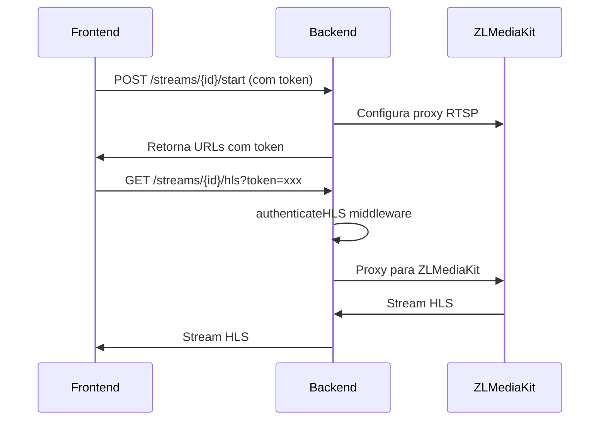

# Diagnóstico Completo do Sistema de Streaming NewCAM

## 1. Resumo do Problema

**Erro Principal:** `401 Unauthorized` nas URLs HLS do ZLMediaKit

**URL Falhando:** `http://localhost:3002/api/streams/d265cb51-b1cf-4f17-aee3-2434d13633e9_hls_medium/hls`

**Sintomas:**
- Erro `net::ERR_BLOCKED_BY_RESPONSE.NotSameOrigin 401 (Unauthorized)`
- Stream não carrega no player de vídeo
- Autenticação HLS falhando

## 2. Arquitetura do Sistema de Streaming

### 2.1 Componentes Principais

1. **Frontend (React)** - Porta 5174/5175/5176
   - Interface de usuário para visualização de câmeras
   - Player de vídeo HLS
   - Gerenciamento de tokens de autenticação

2. **Backend (Node.js)** - Porta 3002
   - API REST para controle de streams
   - Middleware de autenticação
   - Proxy para ZLMediaKit

3. **ZLMediaKit** - Porta 8080 (HTTP), 8554 (RTSP), 1935 (RTMP)
   - Servidor de streaming de mídia
   - Processamento de streams RTSP para HLS/FLV
   - Sistema de hooks para autenticação

### 2.2 Fluxo de Autenticação



## 3. Configurações Atuais

### 3.1 Variáveis de Ambiente

**Backend (.env):**
```env
ZLM_BASE_URL=http://localhost:8000
BACKEND_URL=http://localhost:3002
```

**Problema Identificado:** `ZLM_BASE_URL` configurado para porta 8000, mas ZLMediaKit roda na porta 8080

### 3.2 Configurações do ZLMediaKit

**Arquivo:** `docker/zlmediakit/config.ini`

**Configurações Críticas:**
- `secret=9QqL3M2K7vHQexkbfp6RvbCUB3GkV4MK`
- `enable=1` (hooks habilitados)
- Hooks apontam para: `http://host.docker.internal:3002/api/hook/`
- Portas: HTTP=80 (interno), RTSP=554, RTMP=1935

**Mapeamento Docker:**
- 8080:80 (HTTP)
- 8554:554 (RTSP)
- 1935:1935 (RTMP)
- 8088:8088 (Admin)

### 3.3 Rotas de Streaming (Backend)

**Arquivo:** `backend/src/routes/streams.js`

**Rotas HLS:**
```javascript
// Proxy HLS com autenticação
router.get('/:streamId/hls', authenticateHLS, async (req, res) => {
  const streamId = req.params.streamId;
  const targetUrl = `${ZLM_BASE_URL}/live/${streamId}.live.m3u8`;
  // Proxy para ZLMediaKit
});
```

**Middleware authenticateHLS:**
```javascript
const authenticateHLS = async (req, res, next) => {
  try {
    let token = req.headers.authorization?.replace('Bearer ', '') || req.query.token;
    if (!token) {
      return res.status(401).json({ error: 'Token de acesso requerido' });
    }
    // Validação do token...
  } catch (error) {
    return res.status(401).json({ error: 'Token inválido' });
  }
};
```

## 4. Análise de Problemas

### 4.1 Problema Principal: Configuração de Porta

**Inconsistência Detectada:**
- `ZLM_BASE_URL=http://localhost:8000` (configurado)
- ZLMediaKit rodando na porta 8080 (real)

**Impacto:**
- Backend tenta conectar na porta 8000 (inexistente)
- Proxy HLS falha
- Retorna 401 Unauthorized

### 4.2 Problemas Secundários

1. **CORS (Cross-Origin Resource Sharing)**
   - Erro `net::ERR_BLOCKED_BY_RESPONSE.NotSameOrigin`
   - Frontend (5174) tentando acessar Backend (3002)

2. **Autenticação de Token**
   - Token pode não estar sendo passado corretamente
   - Middleware authenticateHLS pode estar rejeitando tokens válidos

3. **Configuração Docker**
   - ZLMediaKit pode não estar acessível via `host.docker.internal`
   - Hooks podem não estar funcionando

## 5. Plano de Correção

### 5.1 ✅ Correção Imediata - Configuração de Porta (CONCLUÍDA)

**Ação:** Corrigir `ZLM_BASE_URL` no arquivo `.env`

```env
# Antes
ZLM_BASE_URL=http://localhost:8000

# Depois
ZLM_BASE_URL=http://localhost:8080
```

**Status:** ✅ CORRIGIDO - Arquivo `.env` atualizado com a porta correta 8080

### 5.2 Verificação de Conectividade

**Testes a realizar:**
1. Verificar se ZLMediaKit está rodando: `http://localhost:8080`
2. Testar endpoint de API: `http://localhost:8080/index/api/getApiList`
3. Verificar hooks: `http://localhost:3002/api/hook/on_publish`

### 5.3 ✅ Configuração CORS (CONCLUÍDA)

**Ação:** Adicionar portas do frontend nas origens permitidas

**Arquivo:** `backend/src/config/cors.js`

```javascript
// Antes - apenas 5173
const allowedOrigins = [
  'http://localhost:5173',
  // ...
];

// Depois - incluindo todas as portas
const allowedOrigins = [
  'http://localhost:5173',
  'http://localhost:5174',
  'http://localhost:5175', 
  'http://localhost:5176',
  // ...
];
```

**Status:** ✅ CORRIGIDO - Arquivo CORS atualizado com todas as portas do frontend

### 5.4 Debug de Autenticação

**Adicionar logs no middleware authenticateHLS:**
```javascript
const authenticateHLS = async (req, res, next) => {
  console.log('🔐 authenticateHLS - Headers:', req.headers);
  console.log('🔐 authenticateHLS - Query:', req.query);
  // ... resto do código
};
```

## 6. Verificações de Sistema

### 6.1 Portas em Uso

**Comando para verificar:**
```powershell
netstat -ano | findstr ":8080"
netstat -ano | findstr ":3002"
netstat -ano | findstr ":5174"
```

### 6.2 Status dos Serviços

**ZLMediaKit:**
- URL: `http://localhost:8080`
- Admin: `http://localhost:8088`
- Status: Verificar se responde

**Backend:**
- URL: `http://localhost:3002`
- Health: `http://localhost:3002/api/health`

**Frontend:**
- URL: `http://localhost:5174` (ou 5175/5176)

### 6.3 Logs a Monitorar

1. **Backend Logs:**
   - Erros de conexão com ZLMediaKit
   - Falhas de autenticação
   - Erros de proxy

2. **ZLMediaKit Logs:**
   - Hooks recebidos
   - Streams criados/destruídos
   - Erros de configuração

3. **Browser Console:**
   - Erros CORS
   - Falhas de rede
   - Problemas de token

## 7. Comandos de Diagnóstico

### 7.1 Verificar Conectividade ZLMediaKit

```powershell
# Testar se ZLMediaKit está rodando
curl http://localhost:8080

# Testar API do ZLMediaKit
curl http://localhost:8080/index/api/getApiList

# Verificar streams ativos
curl http://localhost:8080/index/api/getMediaList
```

### 7.2 Testar Backend

```powershell
# Testar conectividade backend
curl http://localhost:3002/api/health

# Testar rota de streams
curl http://localhost:3002/api/streams
```

### 7.3 Debug de Token

```javascript
// No browser console
const token = localStorage.getItem('token');
console.log('Token atual:', token);

// Testar chamada manual
fetch('http://localhost:3002/api/streams/test/hls?token=' + token)
  .then(r => console.log('Status:', r.status))
  .catch(e => console.error('Erro:', e));
```

## 8. Testes Imediatos Pós-Correção

### 8.1 Reiniciar Serviços

**IMPORTANTE:** Após as correções, é necessário reiniciar o backend para aplicar as mudanças:

```powershell
# Parar o backend atual (Ctrl+C no terminal)
# Depois reiniciar:
cd C:\Users\GouveiaRx\Downloads\NewCAM\backend
npm run dev
```

### 8.2 Verificar Conectividade ZLMediaKit

```powershell
# Testar se ZLMediaKit responde na porta 8080
curl http://localhost:8080

# Testar API do ZLMediaKit
curl http://localhost:8080/index/api/getApiList
```

### 8.3 Testar Stream HLS

1. **Abrir o frontend:** `http://localhost:5174` (ou 5175/5176)
2. **Tentar iniciar um stream de câmera**
3. **Verificar no console do browser se o erro 401 ainda persiste**
4. **Verificar logs do backend para mensagens de erro**

### 8.4 Comandos de Debug

```powershell
# Verificar portas em uso
netstat -ano | findstr ":8080"
netstat -ano | findstr ":3002"

# Testar endpoint de streams diretamente
curl http://localhost:3002/api/streams
```

## 9. Próximos Passos

1. ✅ **Concluído:** Corrigir `ZLM_BASE_URL` para porta 8080
2. ✅ **Concluído:** Corrigir configuração CORS
3. **Próximo:** Testar conectividade entre componentes
4. **Próximo:** Verificar se erro 401 foi resolvido
5. **Próximo:** Validar fluxo completo de streaming

## 10. Checklist de Verificação

- [x] ✅ **ZLMediaKit rodando na porta 8080** - Configuração corrigida no .env
- [x] ✅ **CORS configurado para todas as portas do frontend** - Portas 5174, 5175, 5176 adicionadas
- [ ] 🔄 **Backend conectando corretamente ao ZLMediaKit** - Aguardando reinicialização
- [ ] 🔄 **Hooks configurados e funcionando** - Verificar após reinicialização
- [ ] 🔄 **Tokens sendo passados corretamente** - Testar após correções
- [ ] 🔄 **Middleware authenticateHLS funcionando** - Verificar logs
- [ ] 🔄 **Proxy HLS retornando streams válidos** - Testar streaming
- [ ] 🔄 **Player de vídeo carregando streams** - Teste final

### Status das Correções

✅ **CONCLUÍDO:**
- Configuração de porta ZLMediaKit (8000 → 8080)
- Configuração CORS para múltiplas portas do frontend

🔄 **PENDENTE:**
- Reinicialização do backend para aplicar mudanças
- Testes de conectividade
- Validação do fluxo de streaming

---

**Data:** $(Get-Date -Format "yyyy-MM-dd HH:mm:ss")
**Status:** Diagnóstico inicial - Aguardando correções