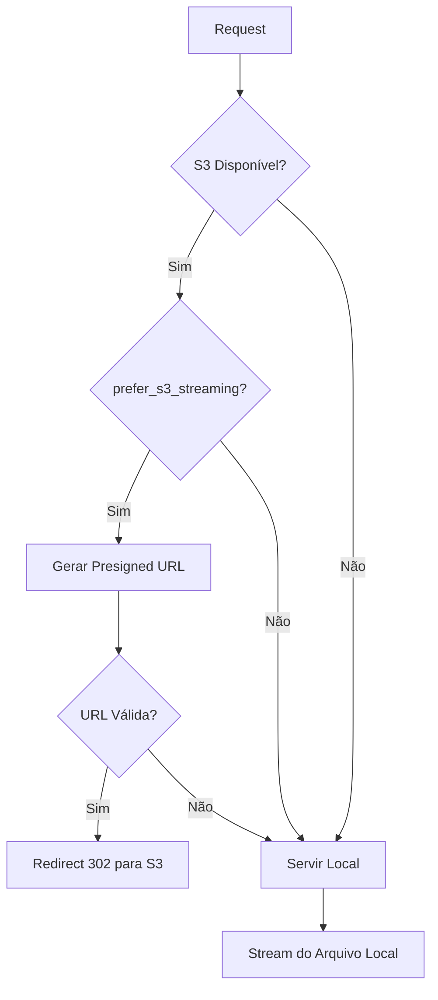

# API Contract - Recording Routes

## Rotas Canônicas Oficiais

Este documento define as rotas oficiais para o sistema de gravações. Todas as outras rotas devem ser consideradas deprecated e removidas.

### 📹 Recording Endpoints

#### Stream de Vídeo
```
GET /api/recordings/:id/stream
```
- **Autenticação**: Requerida (JWT Bearer Token)
- **Descrição**: Stream adaptativo com fallback automático S3 → Local
- **Query Params**:
  - `force_local=true` - Forçar uso de arquivo local (ignorar S3)
- **Headers de Resposta**:
  - `X-Storage-Location`: 's3' | 'local'
  - `Content-Type`: 'video/mp4'
  - `Accept-Ranges`: 'bytes'
- **Suporta**: Range requests para streaming parcial

#### Download de Arquivo
```
GET /api/recordings/:id/download
```
- **Autenticação**: Requerida (JWT Bearer Token)
- **Descrição**: Download completo com fallback automático S3 → Local
- **Query Params**:
  - `force_local=true` - Forçar uso de arquivo local
- **Headers de Resposta**:
  - `Content-Disposition`: 'attachment; filename="..."'
  - `Content-Type`: 'video/mp4'
  - `X-Storage-Location`: 's3' | 'local'

#### Metadata do Arquivo
```
HEAD /api/recordings/:id/info
```
- **Autenticação**: Requerida (JWT Bearer Token)
- **Descrição**: Retorna apenas headers com informações do arquivo
- **Headers de Resposta**:
  - `Content-Length`: Tamanho em bytes
  - `Content-Type`: 'video/mp4'
  - `Last-Modified`: Data de modificação
  - `ETag`: Hash do arquivo (se disponível)
  - `X-Storage-Location`: 's3' | 'local'
  - `X-S3-Key`: Chave S3 (se aplicável)

#### Stream Web (H264)
```
GET /api/recordings/:id/play-web
```
- **Autenticação**: Requerida (JWT Bearer Token)
- **Descrição**: Transcodificação em tempo real de HEVC → H264 para browsers
- **Headers de Resposta**:
  - `Content-Type`: 'video/mp4'
  - `Transfer-Encoding`: 'chunked'
- **Notas**: 
  - Usa FFmpeg para converter em tempo real
  - Maior latência inicial devido à transcodificação
  - Compatível com todos os browsers modernos

### 🚫 Rotas Deprecated (Remover)

As seguintes rotas devem ser removidas ou redirecionadas:

- ❌ `/api/recording-files/*` - Usar `/api/recordings/*`
- ❌ `/recordings/*` (estático) - Removido por segurança
- ❌ `/streams/*` (estático sem auth) - Removido por segurança
- ❌ Duplicatas em `recordings.js` - Consolidar em `recordingFiles.js`

### 🔒 Segurança

- **Todas** as rotas de recording **DEVEM** ter autenticação
- **Nenhuma** exposição estática direta de arquivos
- Validação de permissões por câmera/usuário
- Rate limiting: 100 requests/min por IP
- Sanitização de IDs contra path traversal

### 📊 Estados de Upload

Estados oficiais (upload_status):
- `pending` - Aguardando processamento
- `queued` - Na fila de upload
- `uploading` - Upload em progresso
- `uploaded` - Upload concluído com sucesso
- `failed` - Upload falhou

### 🔄 Fluxo de Fallback



### 📝 Exemplos de Uso

```javascript
// Frontend - Consumo correto
const API_BASE = '/api/recordings';

// Stream
const streamUrl = `${API_BASE}/${recordingId}/stream`;

// Download
const downloadUrl = `${API_BASE}/${recordingId}/download`;

// Info
const response = await fetch(`${API_BASE}/${recordingId}/info`, {
  method: 'HEAD',
  headers: { 'Authorization': `Bearer ${token}` }
});

// Play Web (H264)
const h264Url = `${API_BASE}/${recordingId}/play-web`;
```

### 🚀 Migração

1. **Fase 1**: Adicionar redirects temporários de rotas antigas
2. **Fase 2**: Atualizar frontend para usar rotas canônicas
3. **Fase 3**: Remover rotas antigas após 2 semanas
4. **Fase 4**: Remover código morto e simplificar

---

**Última Atualização**: 2025-08-21
**Versão**: 1.0.0